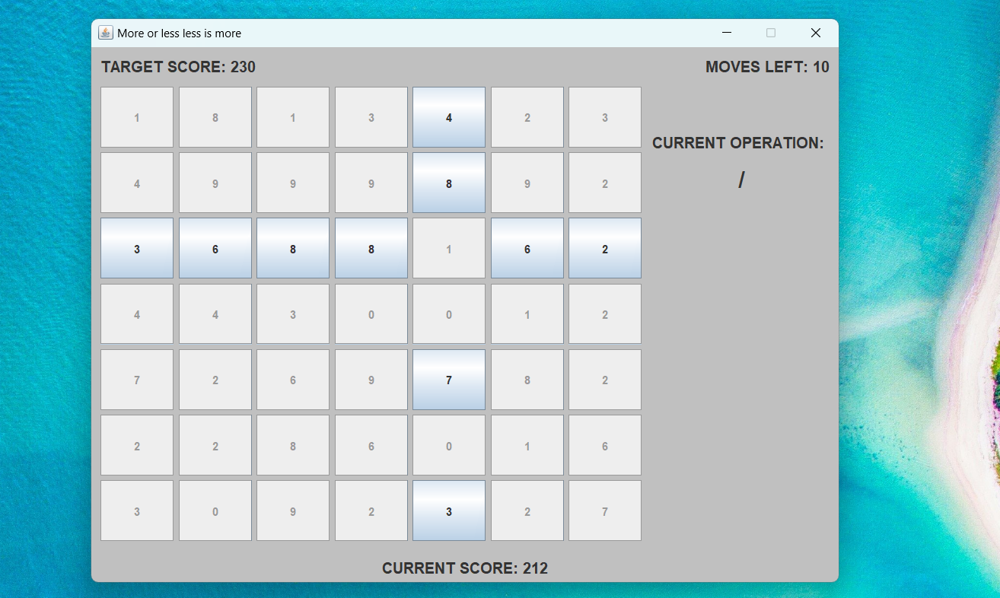

# VDN2 ("More is less is more??")
VDN2 for Programing 1 Class

"More is less less is more" game for second bigger homework for Programing 1 Class.

How to play?
1. Run the game and select the prefered difficulty and board size.
2. The game will then generate the board with random numbers between 0 and 9 for each position on the board.
3. Available moves, current score, target score and current operator is shown around the board.
4. Point of the game is to get your score the same as target score, where your current score is simply just a sum of all the numbers on the board.
5. First, you click any button on the grid and the game will lock all the buttons that are not located in the same row or column as the previously selected button(A).
6. You then click any of the available buttons(B), and the value of the first button(A) will change with the following formula A=(A operation B) % 10. 
    *Reminder: Operations are randomly selected from following symbols and are shown next to the board: "+"(addition), "-"(subtraction), "/"(division) and "\*"(multiplication).*
7. If you get to the target score before running out of moves, CONGRATULATIONS, you won!

## SCREENSHOTS
#### START MENU

#### GAME

